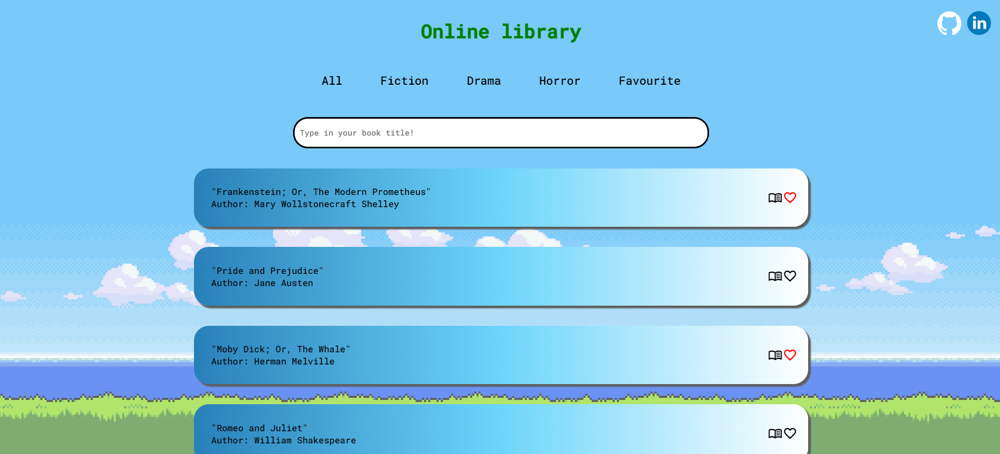

# Online library with books from Project Gutenberg 📖📔
## Description
A website where you can read books whose copyrights have expired!

This project was created as a recruitment assignment for Solvro.

You can read books, filter them by categories and add your favorites to favorites list.

## Demo
https://olekszczepanowski.github.io/gutenberg-books/





## Installation

```bash
git clone https://github.com/olekszczepanowski/gutenberg-books.git
cd gutenberg-books
npm install
npm run dev
```
